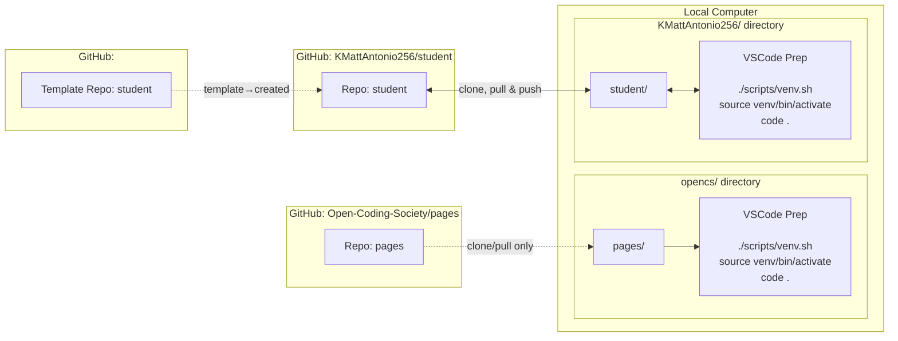
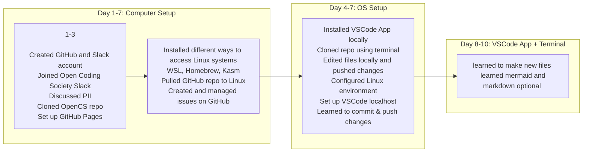

## Visual Journey

Linux is the most compatible OS for Developers.  

This visual helps remind me of the steps I’ve taken in my Computer Science journey so far.

```mermaid
flowchart LR
   %% GitHub Sources
   subgraph GitHub_Pages[GitHub: Open-Coding-Society/pages]
       A[Repo: pages]:::repo
   end


   subgraph GitHub_Template[GitHub:]
       T[Template Repo: student]:::repo
   end


   subgraph GitHub_Student[GitHub: KMattAntonio256/student]
       B[Repo: student]:::repo
   end


   %% Local Computer
   subgraph Local[Local Computer]
       subgraph opencs_dir[opencs/ directory]
           C[pages/]:::local
           Ccmd[VSCode Prep<br/><br/>./scripts/venv.sh<br/>source venv/bin/activate<br/>code .]:::cmd
       end
       subgraph user_dir[KMattAntonio256/ directory]
           D[student/]:::local
           Dcmd[VSCode Prep<br/><br/>./scripts/venv.sh<br/>source venv/bin/activate<br/>code .]:::cmd
       end
   end


   %% Arrows: cloning
   A -.->|clone/pull only| C
   B <--> |clone, pull & push| D


   %% Arrows: template relationship
   T -.->|template→created| B


   %% Arrows: commands
   C --> Ccmd
   D <--> Dcmd
  
```

```mermaid
flowchart LR
    %% Day 1-7: Computer Setup
    subgraph Day_1[Day 1-7: Computer Setup]
        A[1-3<br/><br/>Created GitHub and Slack account<br/>Joined Open Coding Society Slack<br/>Discussed PII<br/>Cloned OpenCS repo<br/>Set up GitHub Pages]:::dayuno
        B[Installed different ways to access Linux systems<br/>WSL, Homebrew, Kasm<br/>Pulled GitHub repo to Linux<br/>Created and managed issues on GitHub]:::daydos
    end

    %% Day 4-7: OS Setup
    subgraph Day_2[Day 4-7: OS Setup]
        C[Installed VSCode App locally<br/>Cloned repo using terminal<br/>Edited files locally and pushed changes<br/>Configured Linux environment<br/>Set up VSCode localhost<br/>Learned to commit & push changes]:::daytres
    end

    %% Day 8-10: VSCode App & Terminal
    subgraph Day_3[Day 8-10: VSCode App + Terminal]
        D[learned to make new files <br/> learned mermaid and markdown optional <br/> ]:::daycuatro
    end


    %% Connect the Phases
    A --> B
    B --> C
    C --> D
```
